  

   

  
  
  

 

I like the “wait, why does this do that?” moment. Then I open the source.

  
<strong>Open-source patches</strong>

   

  - [Submitty #12678](https://github.com/Submitty/Submitty/pull/12678) · Forum files and submissions open in normal tabs.
  - [Qiskit pauli-prop #90](https://github.com/Qiskit/pauli-prop/pull/90) · API source links now match the package layout.
  - [Qiskit Serverless #2516](https://github.com/Qiskit/qiskit-serverless/pull/2516) · Documented `job.result(wait=False)`.
  - [PennyLane Catalyst #3272](https://github.com/PennyLaneAI/catalyst/pull/3272) · Corrected the dictionary ordering note.
  - [Unitary Compiler Collection #713](https://github.com/unitaryfoundation/ucc/pull/713) · Replaced a duplicated checklist with its maintained template.
  - [Qiskit Paulice #63](https://github.com/Qiskit/qiskit-paulice/pull/63) · Updated links to the current tutorial.

 

  <h3>My contribution graph, with a snake 🐍</h3>
  <picture>
    <source media="(prefers-color-scheme: dark)" srcset="https://raw.githubusercontent.com/Asterisk-Hunter/Asterisk-Hunter/output/contribution-snake-dark.svg" />
    <source media="(prefers-color-scheme: light)" srcset="https://raw.githubusercontent.com/Asterisk-Hunter/Asterisk-Hunter/output/contribution-snake.svg" />
    
  </picture>

