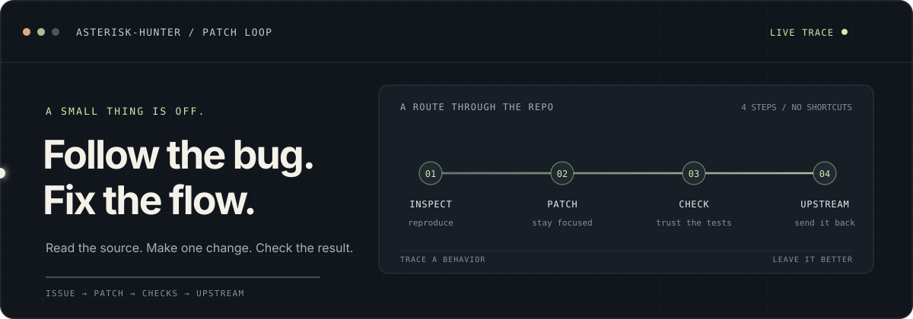

  

# Chandra Teja Pannem

I like finding the small things that break the flow, tracing them to the source, and sending back a focused fix.

**A few patches in the wild:** [Submitty #12678](https://github.com/Submitty/Submitty/pull/12678) · [pauli-prop #90](https://github.com/Qiskit/pauli-prop/pull/90) · [Serverless #2516](https://github.com/Qiskit/qiskit-serverless/pull/2516) · [Catalyst #3272](https://github.com/PennyLaneAI/catalyst/pull/3272) · [UCC #713](https://github.com/unitaryfoundation/ucc/pull/713) · [Paulice #63](https://github.com/Qiskit/qiskit-paulice/pull/63)

Browser behavior · API docs · async results · Python semantics · contributor workflow · tutorial navigation

 

[Portfolio](https://www.chandrateja.dev) · [LinkedIn](https://in.linkedin.com/in/chandra-teja-pannem) · [LeetCode](https://leetcode.com/u/q4i6j3jtL8/)
