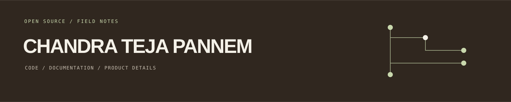

  

# Chandra Teja Pannem

I look for the small mismatches that quietly interrupt a developer: a dead source link, behavior nobody documented, or a page that opens in a window you cannot use properly.

## Selected upstream work

### Product behavior

- **[Submitty · PR #12678](https://github.com/Submitty/Submitty/pull/12678)** Replaced fixed-size popups for forum files and submissions with regular browser tabs.

### Documentation and developer paths

- **[Qiskit pauli-prop · PR #90](https://github.com/Qiskit/pauli-prop/pull/90)** Fixed API source links to follow the package's actual `python/` directory layout.
- **[Qiskit Serverless · PR #2516](https://github.com/Qiskit/qiskit-serverless/pull/2516)** Explained the non-blocking behavior of `job.result(wait=False)` and how to check for completion.
- **[PennyLane Catalyst · PR #3272](https://github.com/PennyLaneAI/catalyst/pull/3272)** Corrected pipeline documentation to match Python's dictionary ordering guarantee.
- **[Unitary Compiler Collection · PR #713](https://github.com/unitaryfoundation/ucc/pull/713)** Removed a duplicated proposal checklist and pointed contributors to its maintained template.
- **[Qiskit Paulice · PR #63](https://github.com/Qiskit/qiskit-paulice/pull/63)** Updated tutorial links to the current Qiskit platform guide.

I check the behavior or source before changing its explanation, keep the patch focused, and leave unrelated work alone.

## Elsewhere

[Portfolio](https://www.chandrateja.dev) · [LinkedIn](https://in.linkedin.com/in/chandra-teja-pannem) · [LeetCode](https://leetcode.com/u/q4i6j3jtL8/)
